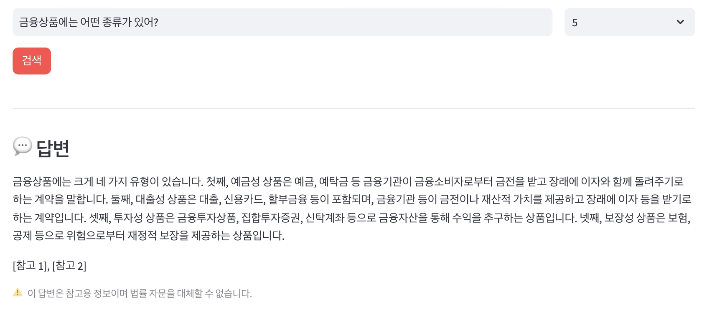

# 금융 법령 정보 검색 시스템 (RAG)

생활법령정보(easylaw.go.kr)의 금융 관련 법령 콘텐츠를 수집하고, 의미 기반 검색과 AI 답변 생성을 결합한 RAG(Retrieval-Augmented Generation) 시스템을 직접 구현했습니다.

직접 사용해 보면서 "답변이 실제로 믿을 만한가?", "검색이 제대로 동작하는가?"를 확인하고, 미흡한 부분을 찾아 개선하는 과정을 함께 기록했습니다.

---

## 화면 구현

### 메인 페이지

<p align="center"></p>

### 질문 결과

<p align="center"></p>

---

## 주요 기능

* **의미 기반 검색**: 키워드 매칭이 아닌 벡터 유사도(코사인 유사도) 기반 검색
* **AI 답변 생성**: Upstage Solar Pro2 LLM을 활용한 문맥 기반 답변 생성
* **원본 자료 출처 표시**: 답변 근거가 된 법령 원문 청크를 유사도 점수와 함께 표시
* **검색 결과 수 조절**: 3 / 5 / 10건 선택 가능

---

## 유사도 기반 문서 검색

<p align="center"></p>

* 테스트 쿼리 3개("예금자 보호 한도", "보험 청약 취소", "대출 계약 해지") 실행
* 각 결과에 코사인 유사도 점수(0.67, 0.56 등)와 함께 상위 청크 반환

---

## 기술 스택

| 구성 요소 | 기술 |
|-----------|------|
| 데이터 수집(크롤링) | requests, BeautifulSoup4 |
| 임베딩 모델 | [jhgan/ko-sroberta-multitask](https://huggingface.co/jhgan/ko-sroberta-multitask) |
| 벡터 DB | FAISS (IndexFlatIP) |
| LLM | Upstage Solar Pro3 |
| 웹 UI | Streamlit |

---

## 데이터 파이프라인

```text
crawling → law_data
      ↓
[EDA: text_eda]
      ↓
extract → text_sections
      ↓
chunking → chunks
      ↓
embedding → embeddings + chunks_meta
      ↓
vector_search → faiss_index
      ↓
app
```

### 파이프라인 단계별 설명

#### 1. 크롤링 (`crawling.py`)

* easylaw.go.kr에서 금융 법령 콘텐츠 수집 → `law_data.json`
* HTML 구조 분석을 통해 제목(`plv1a`), 소제목(`plv2a`), 본문(`plv3a`), 주석(`tplv2d`), 표(`tplvN`) 유형별로 파싱

#### 2. EDA (`text_eda.ipynb`)

* 텍스트 길이 분포 분석으로 청킹 파라미터 결정

#### 3. 추출 (`extract.py`)

* 크롤링 원본(`law_data.json`)에서 섹션 제목·본문·표를 구조화 → `text_sections.json`
* 텍스트 타입(`heading`, `text`, `note`)과 표(`table`)를 분리해 청킹에 적합한 형태로 변환

#### 4. 청킹 (`chunking.py`)

* 법령 섹션을 적절한 크기의 청크로 분할 → `chunks.json`
* 목표 크기: 500자 / 최대 크기: 700자 / 최소 크기: 100자
* 표(table)는 마크다운 형식으로 별도 청크 생성 — 수치·구조 정보 보존

#### 5. 임베딩 (`embedding.py`)

* 한국어 특화 모델로 청크 벡터화 → `embeddings.npy`, `chunks_meta.json`

#### 6. 인덱스 구축 (`vector_search.py`)

* FAISS 인덱스 생성 → `faiss_index.bin`

#### 7. 서비스 (`app.py`)

* Streamlit 검색 앱 실행

---

## 답변 품질 확인

시스템을 직접 사용하면서 답변이 어떤 상황에서 잘 동작하는지, 어떤 부분이 취약한지 확인했습니다.

### 확인 결과 요약

| 항목 | 상태 | 내용 |
|------|------|------|
| Faithfulness (충실성) | 부분 충족 | 프롬프트 지침 있음, 자동 검증 없음 |
| Context Precision (검색 정밀도) | 부분 충족 | 유사도 임계값 없음 |
| Answer Relevance (답변 관련성) | 부분 충족 | 구조적 강제 없음 |
| 수치 정확성 | 미충족 | 검증 레이어 없음 |
| Safety (면책 안내) | 충족 | 이중 안전장치 존재 |

### 항목별 내용

**Faithfulness**

시스템 프롬프트로 참고 자료 외의 내용을 답변하지 않도록 지시하고 있으나, LLM이 실제로 이를 지키는지 사후 검증하는 장치가 없습니다. 프롬프트 지침은 모델의 확률적 동작에 의존하기 때문에 100% 보장이 어렵습니다.

**Context Precision**

유사도 점수가 낮은 청크도 상위 k개에 포함되어 컨텍스트로 넘어갑니다. 금융 법령 특성상 유사 표현이 다른 맥락에서 반복되어, 의미상 관련 없는 조항이 혼입될 수 있습니다.

**수치 정확성**

금액, 기간 등 수치 정보는 LLM이 변형하기 쉽고, 오류 시 직접적인 피해로 이어질 수 있는 항목입니다. 현재 생성된 답변의 수치를 원본 청크와 대조하는 검증 과정이 없습니다.

**Safety**

LLM 프롬프트 지침과 UI 고정 문구로 이중 방어를 구현했습니다. LLM이 면책 안내를 생략하더라도 사용자는 UI에서 반드시 해당 문구를 확인합니다.

```python
# UI에 항상 표시 (LLM 동작과 무관)
st.caption("⚠️ 이 답변은 참고용 정보이며 법률 자문을 대체할 수 없습니다.")
```

---

## 설치 및 실행

### 1. 패키지 설치

```bash
pip install -r requirements.txt

```

### 2. 환경변수 설정

```bash
export UPSTAGE_API_KEY="your-upstage-api-key"
```

### 3. 사전 생성 파일 확인

앱 실행 전 아래 파일이 있어야 합니다.

```text
project_finance/
├── data/
│   └── chunks_meta.json
└── index/
    └── faiss_index.bin
```

파일이 없다면 파이프라인을 순서대로 실행합니다.

```bash
python src/crawling.py
python src/extract.py
python src/chunking.py
python src/embedding.py
python src/vector_search.py
```

### 4. 앱 실행

```bash
streamlit run app.py
```

---

## 파일 구조

```text
project_finance/
├── app.py               # Streamlit 메인 앱 (진입점)
├── README.md
├── evaluation.md        # 답변 품질 확인 기록
├── src/                 # 파이프라인 스크립트
│   ├── crawling.py      # easylaw.go.kr 크롤러
│   ├── extract.py       # law_data → text_sections 변환
│   ├── chunking.py      # 텍스트 청킹 모듈
│   ├── embedding.py     # 벡터 임베딩 생성
│   └── vector_search.py # FAISS 인덱스 구축 및 검색
├── data/                # 원본 및 처리 데이터
│   ├── law_data.json        # 원본 크롤링 데이터
│   ├── text_sections.json   # 섹션 단위 정제 텍스트
│   ├── chunks.json          # 청킹된 텍스트
│   └── chunks_meta.json     # 임베딩 메타정보
├── index/               # 벡터 인덱스 파일
│   ├── embeddings.npy       # 벡터 임베딩 배열
│   └── faiss_index.bin      # FAISS 인덱스
├── notebook/            # EDA 분석 노트북
│   └── text_eda.ipynb       # 텍스트 길이 분포 EDA
└── image/               # UI 스크린샷
```

---

## 검색 예시

| 질문 | 답변 |
|----|-----|
|모르는 사람에게 잘못 송금했습니다. 송금한 금액을 돌려받을 수 있는 방법이 있을까요? | "착오송금 반환지원제도를 통해 송금한 금액을 돌려받을 수 있습니다. 자금이체 금융회사 등을 통하여 착오 송금한 송금인의 신청이 있는 경우 예금보험공사가 대신 찾아주는 제도입니다. 해당 제도는 「예금자보호법」 제39조의2제1항에 근거하며, 예금보험공사 금융안심포털(https://fins.kdic.or.kr) 에서 신청대상여부 확인 및 반환지원신청을 할 수 있습니다." |
|금융상품에는 어떤 종류가 있어? | "금융상품에는 크게 네 가지 유형이 있습니다. 첫째, 예금성 상품은 예금, 예탁금 등 금융기관이 금융소비자로부터 금전을 받고 장래에 이자와 함께 돌려주기로 하는 계약을 말합니다. 둘째, 대출성 상품은 대출, 신용카드, 할부금융 등이 포함되며, 금융기관 등이 금전이나 재산적 가치를 제공하고 장래에 이자 등을 받기로 하는 계약입니다. 셋째, 투자성 상품은 금융투자상품, 집합투자증권, 신탁계좌 등으로 금융자산을 통해 수익을 추구하는 상품입니다. 넷째, 보장성 상품은 보험, 공제 등으로 위험으로부터 재정적 보장을 제공하는 상품입니다." |
|차를 사서 500만원을 12개월 할부로 갚으려고 해. 매달 얼마 내면 돼? | "할부로 차를 구매할 경우 매달 상환해야 하는 금액은 대출 금액, 이자율, 상환 기간 등에 따라 결정됩니다. 제공된 참고 자료에는 할부 구매와 관련된 구체적인 상환 금액 계산 방법이 포함되어 있지 않습니다. 따라서 정확한 상환 금액을 안내하기 위해서는 해당 금융 상품의 이자율 및 상환 조건을 확인해야 합니다." |

---

## 주의사항

* 이 시스템은 정보 제공 목적이며, 법률 자문을 대체하지 않습니다.
* `UPSTAGE_API_KEY`가 없을 경우 AI 답변 없이 검색 결과만 표시됩니다.
* 데이터 출처: [국가법령정보센터 생활법령정보](https://www.easylaw.go.kr)

---

## 개선 이력

| 날짜 | 대상 | 내용 |
|------|------|------|
| 2026-06-23 | `crawling.py` | 테이블 추출 범위 확장 — `tplv5`만 처리하던 조건을 `tplv\d+$` 정규식으로 변경해 `tplv4` 등 다른 variant에 포함된 테이블도 수집되도록 개선 |
| 2026-06-24 | `src/extract.py` | 파이프라인 누락 단계 추가 — `law_data.json`에서 섹션 제목·본문·표를 분리해 `text_sections.json`으로 변환하는 모듈 신규 작성 |
| 2026-06-24 | `src/vector_search.py` | 인덱스 구축 시 `faiss.normalize_L2` 추가 — 임베딩 저장 이후 정밀도 손실 가능성을 방지하기 위한 이중 정규화 적용 |
| 2026-06-24 | `app.py` | system_prompt 개선 — 링크 출력 형식 명시(조사 분리), 출력 형식 템플릿 및 정·오답 예시 추가, `temperature=0.2`로 답변 일관성 향상 |
