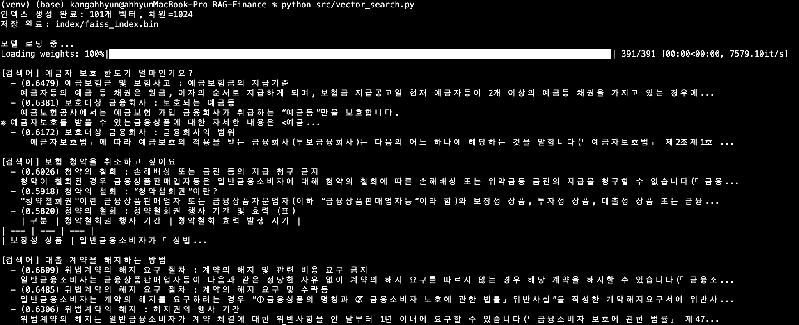

# 금융 법령 정보 검색 시스템 (RAG)

생활법령정보(easylaw.go.kr)의 금융 관련 법령 콘텐츠를 수집하고, 의미 기반 검색과 AI 답변 생성을 결합한 RAG(Retrieval-Augmented Generation) 시스템을 직접 구현했습니다.

직접 사용해 보면서 "답변이 실제로 믿을 만한가?", "검색이 제대로 동작하는가?"를 확인하고, 미흡한 부분을 찾아 개선하는 과정을 함께 기록했습니다.

---

## 화면 구현

### 메인 페이지

<p align="center"></p>

### 질문 결과

<p align="center"></p>

---

## 주요 기능

* **의미 기반 검색**: 키워드 매칭이 아닌 벡터 유사도(코사인 유사도) 기반 검색
* **AI 답변 생성**: Upstage Solar Pro3 LLM을 활용한 문맥 기반 답변 생성
* **원본 자료 출처 표시**: 답변 근거가 된 법령 원문 청크를 유사도 점수와 함께 표시
* **검색 결과 수 조절**: 3 / 5 / 10건 선택 가능

---

## 유사도 기반 문서 검색

<p align="center"></p>

* 테스트 쿼리 3개("예금자 보호 한도", "보험 청약 취소", "대출 계약 해지") 실행
* 각 결과에 코사인 유사도 점수(0.67, 0.56 등)와 함께 상위 청크 반환

---

## 기술 스택

| 구성 요소 | 기술 |
|-----------|------|
| 데이터 수집(크롤링) | requests, BeautifulSoup4 |
| 임베딩 모델 | [nlpai-lab/KURE-v1](https://huggingface.co/nlpai-lab/KURE-v1) (한국어 특화, 8192토큰, 1024차원) |
| 벡터 DB | FAISS (IndexFlatIP) |
| LLM | Upstage Solar Pro3 |
| 웹 UI | Streamlit |

---

## 데이터 파이프라인

```text
crawling → law_data
      ↓
[EDA: text_eda]
      ↓
extract → text_sections
      ↓
chunking → chunks
      ↓
embedding → embeddings + chunks_meta
      ↓
vector_search → faiss_index
      ↓
app
```

### 파이프라인 단계별 설명

#### 1. 크롤링 (`crawling.py`)

* easylaw.go.kr에서 금융 법령 콘텐츠 수집 → `law_data.json`
* HTML 구조 분석을 통해 제목(`plv1a`), 소제목(`plv2a`), 본문(`plv3a`), 주석(`tplv2d`), 표(`tplvN`) 유형별로 파싱

#### 2. EDA (`text_eda.ipynb`)

* 텍스트 길이 분포 분석으로 청킹 파라미터 결정

#### 3. 추출 (`extract.py`)

* 크롤링 원본(`law_data.json`)에서 섹션 제목·본문·표를 구조화 → `text_sections.json`
* 텍스트 타입(`heading`, `text`, `note`)과 표(`table`)를 분리해 청킹에 적합한 형태로 변환
* `body`가 순서 있는 리스트라는 점을 이용해 **heading을 만날 때마다 새 블록을 시작** — 소제목과 그에 딸린 본문·표가 한 레코드로 묶입니다(38개 섹션 → 93개 레코드)

#### 4. 청킹 (`chunking.py`)

* 법령 섹션을 적절한 크기의 청크로 분할 → `chunks.json`
* 목표 크기: 500자 / 최대 크기: 700자 / 최소 크기: 100자
* 표(table)는 마크다운 형식으로 **표 1개 = 청크 1개**로 생성 — 수치·구조 정보 보존. 표가 청크 경계로 잘리면 헤더와 행의 대응이 끊겨 사실상 못 쓰게 되므로 쪼개지 않습니다(임베딩 모델이 8192토큰이라 쪼갤 이유도 없음)
* 다만 `MAX_TABLE_CHUNK_SIZE`(4000자)를 넘는 비정상적으로 큰 표는 **행 경계에서** 분할하고 조각마다 헤더 행 + 구분선을 반복합니다. 검색 품질 손잡이가 아니라 임베딩 상한을 넘지 않게 하는 안전장치이며, 현재 데이터(최대 1853자)에서는 동작하지 않습니다
* 분할이 일어난 표 조각은 제목에 파트 번호(`... (표) 1/3`)를, 메타에 `table_group` / `part` / `part_total`을 갖습니다
* 청크 제목은 `대제목 : 소제목` 형식(예: `접근매체의 사용 및 관리 : 접근매체 양도 등 금지`). `embedding.py`가 제목을 본문과 함께 임베딩하므로 소제목이 검색 신호로 사용됩니다

#### 5. 임베딩 (`embedding.py`)

* 한국어 특화 모델로 청크 벡터화 → `embeddings.npy`, `chunks_meta.json`
* 최초 실행 시 모델(약 2.2GB)을 내려받습니다

#### 6. 인덱스 구축 (`vector_search.py`)

* FAISS 인덱스 생성 → `faiss_index.bin`

#### 7. 서비스 (`app.py`)

* Streamlit 검색 앱 실행

---

## 답변 품질 확인

시스템을 직접 사용하면서 답변이 어떤 상황에서 잘 동작하는지, 어떤 부분이 취약한지 확인했습니다.

정량 측정을 위한 평가용 골든셋 30문항을 구축했습니다(`eval/golden_set.json`, 2026-07-13). 법령 용어 질문 10개 / 구어체 질문 10개(생활법령정보 100문100답 기반) / 코퍼스에 답이 없어 거부가 정답인 질문 10개로 구성됩니다. `python eval/run_eval.py`로 측정하며, LLM 호출 없이 임베딩만 사용하므로 비용이 들지 않고 결과가 결정론적입니다.

### 측정 지표

* **Recall@5** — 정답 청크 중 상위 5건에 포함된 비율. k=5는 앱이 LLM에 실제로 넘기는 청크 수와 맞춘 값입니다(6위 정답은 실전에서 없는 것과 같음).
* **MRR** — 첫 정답이 나온 순위의 역수 평균. "찾았는가"가 아니라 "얼마나 위에 띄웠는가"를 봅니다.
* **전달률** — 정답 청크가 유사도 임계값(현재 0.55)까지 통과해 실제로 LLM 컨텍스트에 들어간 비율. 검색은 됐지만 임계값에 걸려 LLM이 보지 못하는 경우를 잡아냅니다.
* **거부 정확성** — 무정답 질문에서 임계값 통과 청크가 0개여서 LLM 호출을 건너뛴 비율. 법률 도메인에서는 틀린 답보다 "모른다고 못 하는 것"이 더 위험하므로 별도 지표로 두었습니다.

### 청킹 개선 전후 비교 (2026-07-27)

두 번의 청킹 개선을 각각 측정했습니다. ① heading(소제목) 단위 분리, ② 표를 행 경계에서 분할.

| 지표 | ① 이전 (58청크) | ① heading 분리 (101청크) | ② +표 분할 (106청크) |
|------|------|------|------|
| Recall@5 (전체) | 0.817 | 0.812 | 0.787 |
| MRR (전체) | 0.642 | **0.683** | 0.683 |
| 전달률 (전체) | 0.667 | **0.703** | 0.687 |
| Recall@5 (구어체) | 0.700 | **0.717** | 0.700 |
| MRR (구어체) | 0.483 | **0.517** | 0.517 |
| 전달률 (구어체) | 0.400 | **0.500** | 0.500 |
| 거부 정확성 | 0.200 | 0.200 | 0.200 |

청크 단위가 바뀔 때마다 골든셋 정답 라벨을 새 체계로 재판정했습니다(문항당 평균 정답 1.60 → 1.80 → 1.90개, 표 분할을 되돌린 현재는 다시 1.80개). 검색 결과를 확인하기 전에 라벨을 확정해, 결과에 맞춰 라벨을 조정할 여지를 없앴습니다.

**① heading 분리**: Recall@5는 사실상 제자리(0.817 → 0.812)인데 MRR과 전달률이 함께 올랐습니다. 못 찾던 정답을 새로 찾아낸 것이 아니라, 이미 찾던 정답의 순위를 끌어올려 임계값을 넘기게 만든 개선입니다. 구어체 전달률 0.400 → 0.500이 가장 큰 변화로, 실제 앱에서 LLM이 근거 자료를 받는 비율이 올랐다는 뜻입니다. 의도한 대로 개선된 대표 사례는 law-08(접근매체의 양도·양수 금지)로, "접근매체 발급"과 "양도 등 금지"가 한 청크에 묶여 있어 MRR 0.50이었던 것이 분리 후 1.00이 되었습니다.

**② 표 분할**: 목적은 내용 소실 방지였고 그 목적은 달성했습니다(최대 표 청크 1853자 → 759자, 8개 표 전부 무손실 검증). 다만 **검색 지표는 오히려 소폭 하락했습니다.** 하락분은 전부 law-05와 col-02 두 문항에서 나왔는데, 이들의 정답 표가 2조각으로 나뉘면서 정답 청크 수가 2 → 3개로 늘었고 그중 뒷조각이 상위 5건에 들지 못했기 때문입니다. 표 자체는 여전히 검색되므로 검색 능력이 나빠진 것은 아니지만, 정답이 두 조각에 걸친 문항은 k=5에서 만점을 받기 어려워집니다. **지표를 올린 개선이 아니라 데이터 무결성을 확보한 개선**으로 읽는 것이 정확합니다.

> 이 표 분할은 2026-07-29에 **되돌렸습니다.** 임베딩 모델을 8192토큰으로 바꾸면서 표를 쪼갤 이유가 사라졌기 때문입니다(아래 「2차 시도」 참고). 현재 청크 체계는 위 표의 「① heading 분리 (101청크)」와 같습니다.

### 임베딩 모델의 입력 상한 문제 (2026-07-27 발견 → 2026-07-29 해결)

표 분할 작업 중에 확인한 사실입니다. 코드 주석과 이 문서는 임베딩 모델의 상한을 512토큰으로 적어 두었으나, `jhgan/ko-sroberta-multitask`의 `max_seq_length` 실제 기본값은 **128토큰**(한국어 대략 200자)이었습니다. 당시 106개 청크 중 **49개(46%)가 벡터화 단계에서 뒷부분이 잘리고 있었습니다.** 목표 청크 크기 500자·최대 700자라는 설정 자체가 모델이 실제로 읽는 범위를 크게 벗어나 있었던 셈입니다.

같은 모델에서 `max_seq_length`만 512로 올려 잘림을 0건으로 만들어 봤을 때는 Recall@5와 MRR이 소수점까지 동일했고 전달률만 0.016 올랐습니다. **그래서 처음에는 "내용 소실은 실재하지만 검색 품질의 병목은 아니다"라고 결론지었는데, 이건 같은 모델 안에서만 맞는 이야기였습니다.** 모델 체급을 바꾸자 그림이 완전히 달라졌습니다.

### 임계값 재조정과 임베딩 모델 교체 (2026-07-29)

거부 정확성 0.200이 세 번의 청킹 개선으로도 꿈쩍하지 않아, 검색기 자체가 아니라 **임계값과 모델**을 건드렸습니다.

#### 1차 시도 — KF-DeBERTa 계열 (기각)

금융 도메인 말뭉치로 사전학습된 [KF-DeBERTa](https://huggingface.co/kakaobank/kf-deberta-base) 계열을 먼저 시도했습니다.

| 모델 | Recall@5 | MRR | 전달률 | 거부 |
|---|---|---|---|---|
| jhgan/ko-sroberta-multitask | **0.787** | 0.683 | **0.687** | 0.200 |
| upskyy/kf-deberta-multitask | 0.743 | **0.728** | 0.660 | 0.200 |
| kakaobank/kf-deberta-base | 0.475 | 0.392 | 0.475 | 0.000 |

**`kakaobank/kf-deberta-base`는 sentence-transformers 모델이 아니라 MLM 사전학습 인코더입니다.** 풀링 레이어가 없어 `SentenceTransformer`로 로드하면 학습되지 않은 평균 풀링이 임의로 붙습니다. 모델 카드의 KorSTS 85.99는 STS 파인튜닝을 거친 뒤의 점수이며, 그대로 임베딩에 쓰면 위처럼 무너집니다. 거부 정확성 0.000은 무정답 질문 10개 **전부**에서 근거가 임계값을 통과했다는 뜻입니다.

파인튜닝판(`upskyy/kf-deberta-multitask`)은 MRR만 앞설 뿐, **같은 임계값에서 비교하면** 운영점 0.60에서 전달률이 0.585 대 0.637로 뒤졌습니다. 거부 정확성 개선으로 보였던 것은 전부 임계값 몫이었고 모델 자체는 손해여서 되돌렸습니다.

#### 2차 시도 — 긴 컨텍스트 모델 (채택)

128토큰이라는 상한 자체를 없애는 방향으로 옮겼습니다. 청크 체계를 고정해 골든셋 라벨 재판정 없이 순수 모델 효과만 측정했습니다.

| 모델 | 차원 | seq_len | 잘리는 청크 | Recall@5 | MRR | 인덱싱 | 쿼리 |
|---|---|---|---|---|---|---|---|
| jhgan/ko-sroberta-multitask | 768 | 128 | **49/106** | 0.787 | 0.683 | 8s | 18ms |
| **nlpai-lab/KURE-v1 (채택)** | 1024 | 8192 | **0** | **0.887** | 0.808 | 313s | 58ms |
| BAAI/bge-m3 | 1024 | 8192 | **0** | 0.870 | **0.879** | 393s | 42ms |
| Alibaba-NLP/gte-multilingual-base | 768 | 8192 | — | 실행 실패 | — | — | — |

`gte-multilingual-base`는 Apple Silicon MPS 백엔드에서 커스텀 모델 코드(`trust_remote_code`)가 깨져 측정하지 못했습니다. 위 표는 모델 효과만 분리하려고 **당시의 106청크 체계에 고정해** 측정한 값이라, 표 분할을 되돌린 뒤의 최종 수치(Recall@5 0.895)와는 다릅니다.

**1차 시도와 결정적으로 다릅니다.** kf-deberta는 어느 임계값에서도 기존 모델을 못 이기는 교환이었지만, 긴 컨텍스트 모델은 임계값과 무관한 Recall@5·MRR부터 큰 폭으로 앞섭니다. [KURE-v1](https://huggingface.co/nlpai-lab/KURE-v1)은 고려대 NLP&AI 연구실이 `BAAI/bge-m3`를 한국어 질의-문서 200만 쌍으로 파인튜닝한 모델입니다. bge-m3와의 차이는 문항 30개 기준 노이즈 범위지만 Recall@5가 높고 한국어 특화라 채택했습니다.

**부수 효과로 표 분할을 되돌렸습니다.** 8192토큰이면 표를 쪼갤 이유가 없어 표 1개 = 청크 1개로 복원했고(청크 106 → 101개), 논문 기준 Block Integrity가 0.500 → 1.000이 되었습니다. 표 분할은 애초에 128토큰 제약에 떠밀린 작업이었음이 확인된 셈입니다.

#### 임계값 0.55

모델과 청크 체계가 모두 바뀌었으므로 임계값을 다시 쓸었습니다.

| 임계값 | 전달률 | 구어체 전달률 | 거부 정확성 |
|---|---|---|---|
| 0.50 | 0.878 | 0.817 | 0.400 |
| **0.55 (채택)** | **0.745** | **0.550** | **0.700** |
| 0.60 | 0.695 | 0.450 | 0.900 |
| 0.65 | 0.570 | 0.250 | 1.000 |

0.55는 직전 운영점(전달률 0.637 / 구어체 0.450 / 거부 0.600)을 **모든 축에서** 앞섭니다. 0.60의 거부 0.900은 무정답 문항이 10개뿐이라 과적합으로 보고 피했는데, 이전에 0.65~0.66을 같은 이유로 피했던 기준을 그대로 적용한 것입니다.

### 최종 지표 (2026-07-29)

`nlpai-lab/KURE-v1` + 임계값 0.55 + 101청크 기준입니다.

| 지표 | 시작점 (58청크, ko-sroberta, 0.5) | 직전 (106청크, ko-sroberta, 0.60) | 현재 |
|---|---|---|---|
| Recall@5 (전체) | 0.817 | 0.787 | **0.895** |
| MRR (전체) | 0.642 | 0.683 | **0.808** |
| 전달률 (전체) | 0.667 | 0.637 | **0.745** |
| 거부 정확성 | 0.200 | 0.600 | **0.700** |
| Recall@5 (법령 용어) | 0.933 | 0.873 | **0.940** |
| 전달률 (법령 용어) | 0.933 | 0.823 | **0.940** |
| Recall@5 (구어체) | 0.700 | 0.700 | **0.850** |
| MRR (구어체) | 0.483 | 0.517 | **0.733** |
| 전달률 (구어체) | 0.400 | 0.450 | **0.550** |

**처음으로 모든 지표가 동시에 개선됐습니다.** 앞선 청킹 개선들이 지표를 맞바꾸는 데 그쳤던 것과 대비됩니다. 오래 걸려 있던 col-06 회귀("체크카드를 빌려주었는데 처벌받나요")도 정답 청크가 상위 5건에 복귀해 Recall@5가 0.00 → 1.00이 되었습니다.

**남은 문제**

* **구어체 전달률 0.550이 여전히 가장 약합니다.** col-05·col-06·col-07은 정답을 상위 5건 안에 찾아내지만(Recall@5 1.00) 정답 청크의 유사도가 0.50~0.52로 임계값 0.55를 못 넘어 LLM에 전달되지 않습니다. 검색은 성공하고 필터에서 탈락하는 구조라, 다음 개선은 질문 유형별 임계값이나 리랭커가 후보입니다.
* **거부 정확성 튜닝의 과적합 위험** — 무정답 질문 10개로 임계값을 골랐습니다. 골든셋을 늘리기 전까지 0.700은 참고값으로만 봐야 합니다.
* **모델 크기** — KURE-v1은 0.6B / 약 2.2GB로 이전 모델의 5배입니다. 쿼리 지연은 18ms → 58ms로 체감 문제가 없으나, 레포를 처음 받으면 2.2GB를 내려받아야 합니다.

### 확인 결과 요약

| 항목 | 상태 | 내용 |
|------|------|------|
| Faithfulness (충실성) | 부분 충족 | 프롬프트 지침 있음, 사후 검증 없음 |
| Context Precision (검색 정밀도) | 부분 충족 | 유사도 임계값 적용(2026-07-02, 0.55로 재조정 2026-07-29), 골든셋 정량 측정(2026-07-27) — Recall@5 0.895 / MRR 0.808 / 거부 정확성 0.700 |
| Answer Relevance (답변 관련성) | 부분 충족 | 출력 형식 강제 있음, 내용 관련성 자동 측정 없음 |
| 수치 정확성 | 부분 충족 | 프롬프트 계산 금지 규칙 있음(2026-07-02), 결정론적 대조 없음 |
| Safety (면책 안내) | 충족 | 프롬프트 규칙 + UI 고정 문구 이중 레이어 |

### 항목별 내용

**Faithfulness**

시스템 프롬프트로 참고 자료 외의 내용을 답변하지 않도록 지시하고 있으나, LLM이 실제로 이를 지키는지 사후 검증하는 장치가 없습니다. 프롬프트 지침은 모델의 확률적 동작에 의존하기 때문에 100% 보장이 어렵습니다.

**Context Precision**

유사도 임계값 이상 청크만 LLM 컨텍스트에 전달되며, 관련 청크가 없으면 답변 생성 자체를 건너뜁니다(2026-07-02 적용). 골든셋 30문항으로 정량 측정을 시작했고(2026-07-27), 위 표의 수치가 그 결과입니다. 금융 법령 특성상 유사 표현이 다른 맥락에서 반복되어 의미상 관련 없는 조항이 임계값을 넘는 문제가 실제로 확인되었고(거부 정확성 0.200), 임베딩 모델 교체와 임계값 재조정으로 0.700까지 끌어올렸습니다.

**수치 정확성**

금액, 기간 등 수치 정보는 LLM이 변형하기 쉽고, 오류 시 직접적인 피해로 이어질 수 있는 항목입니다. 시스템 프롬프트에 수치를 직접 계산·변환하지 않고 참고 자료 그대로만 인용하도록 규칙을 두었으나(2026-07-02), 이는 확률적 완화책이며 생성된 답변의 수치를 원본 청크와 대조하는 결정론적 검증은 없습니다.

**Safety**

LLM 프롬프트 지침과 UI 고정 문구로 이중 방어를 구현했습니다. LLM이 면책 안내를 생략하더라도 사용자는 UI에서 반드시 해당 문구를 확인합니다.

```python
# UI에 항상 표시 (LLM 동작과 무관)
st.caption("⚠️ 이 답변은 참고용 정보이며 법률 자문을 대체할 수 없습니다.")
```

---

## 설치 및 실행

### 1. 패키지 설치

```bash
pip install -r requirements.txt

```

### 2. 환경변수 설정

```bash
export UPSTAGE_API_KEY="your-upstage-api-key"
```

### 3. 사전 생성 파일 확인

앱 실행 전 아래 파일이 있어야 합니다.

```text
RAG-Finance/
├── data/
│   └── chunks_meta.json
└── index/
    └── faiss_index.bin
```

파일이 없다면 파이프라인을 순서대로 실행합니다.

```bash
python src/crawling.py
python src/extract.py
python src/chunking.py
python src/embedding.py
python src/vector_search.py
```

### 4. 앱 실행

```bash
streamlit run app.py
```

---

## 파일 구조

```text
RAG-Finance/
├── app.py               # Streamlit 메인 앱 (진입점)
├── README.md
├── requirements.txt
├── src/                 # 파이프라인 스크립트
│   ├── crawling.py      # easylaw.go.kr 크롤러
│   ├── extract.py       # law_data → text_sections 변환
│   ├── chunking.py      # 텍스트 청킹 모듈
│   ├── embedding.py     # 벡터 임베딩 생성
│   └── vector_search.py # FAISS 인덱스 구축 및 검색
├── data/                # 원본 및 처리 데이터
│   ├── law_data.json        # 원본 크롤링 데이터
│   ├── text_sections.json   # 섹션 단위 정제 텍스트
│   ├── chunks.json          # 청킹된 텍스트
│   └── chunks_meta.json     # 임베딩 메타정보
├── index/               # 벡터 인덱스 파일
│   ├── embeddings.npy       # 벡터 임베딩 배열
│   └── faiss_index.bin      # FAISS 인덱스
├── eval/                # 검색 품질 평가
│   ├── golden_set.json      # 평가용 골든셋 30문항 (질문 + 정답 chunk_id)
│   ├── run_eval.py          # Recall@5·MRR·전달률·거부 정확성 측정
│   ├── crawl_qna.py         # easylaw.go.kr 100문100답 크롤러 (구어체 질문 원천)
│   └── qna_raw.json         # 100문100답 크롤링 원본
├── docs/                # 문서 및 EDA 노트북
│   └── text_eda.ipynb       # 텍스트 길이 분포 EDA
└── image/               # UI 스크린샷
```

---

## 검색 예시

| 질문 | 답변 |
|----|-----|
|모르는 사람에게 잘못 송금했습니다. 송금한 금액을 돌려받을 수 있는 방법이 있을까요? | "착오송금 반환지원제도를 통해 송금한 금액을 돌려받을 수 있습니다. 자금이체 금융회사 등을 통하여 착오 송금한 송금인의 신청이 있는 경우 예금보험공사가 대신 찾아주는 제도입니다. 해당 제도는 「예금자보호법」 제39조의2제1항에 근거하며, 예금보험공사 금융안심포털(https://fins.kdic.or.kr) 에서 신청대상여부 확인 및 반환지원신청을 할 수 있습니다." |
|금융상품에는 어떤 종류가 있어? | "금융상품에는 크게 네 가지 유형이 있습니다. 첫째, 예금성 상품은 예금, 예탁금 등 금융기관이 금융소비자로부터 금전을 받고 장래에 이자와 함께 돌려주기로 하는 계약을 말합니다. 둘째, 대출성 상품은 대출, 신용카드, 할부금융 등이 포함되며, 금융기관 등이 금전이나 재산적 가치를 제공하고 장래에 이자 등을 받기로 하는 계약입니다. 셋째, 투자성 상품은 금융투자상품, 집합투자증권, 신탁계좌 등으로 금융자산을 통해 수익을 추구하는 상품입니다. 넷째, 보장성 상품은 보험, 공제 등으로 위험으로부터 재정적 보장을 제공하는 상품입니다." |
|차를 사서 500만원을 12개월 할부로 갚으려고 해. 매달 얼마 내면 돼? | "할부로 차를 구매할 경우 매달 상환해야 하는 금액은 대출 금액, 이자율, 상환 기간 등에 따라 결정됩니다. 제공된 참고 자료에는 할부 구매와 관련된 구체적인 상환 금액 계산 방법이 포함되어 있지 않습니다. 따라서 정확한 상환 금액을 안내하기 위해서는 해당 금융 상품의 이자율 및 상환 조건을 확인해야 합니다." |

---

## 주의사항

* 이 시스템은 정보 제공 목적이며, 법률 자문을 대체하지 않습니다.
* `UPSTAGE_API_KEY`가 없을 경우 AI 답변 없이 검색 결과만 표시됩니다.
* 데이터 출처: [국가법령정보센터 생활법령정보](https://www.easylaw.go.kr)

---

## 개선 이력

| 날짜 | 대상 | 내용 |
|------|------|------|
| 2026-06-23 | `crawling.py` | 테이블 추출 범위 확장 — `tplv5`만 처리하던 조건을 `tplv\d+$` 정규식으로 변경해 `tplv4` 등 다른 variant에 포함된 테이블도 수집되도록 개선 |
| 2026-06-24 | `src/extract.py` | 파이프라인 누락 단계 추가 — `law_data.json`에서 섹션 제목·본문·표를 분리해 `text_sections.json`으로 변환하는 모듈 신규 작성 |
| 2026-06-24 | `src/vector_search.py` | 인덱스 구축 시 `faiss.normalize_L2` 추가 — 임베딩 저장 이후 정밀도 손실 가능성을 방지하기 위한 이중 정규화 적용 |
| 2026-06-24 | `app.py` | system_prompt 개선 — 링크 출력 형식 명시(조사 분리), 출력 형식 템플릿 및 정·오답 예시 추가, `temperature=0.2`로 답변 일관성 향상 |
| 2026-07-02 | `app.py` | 유사도 임계값 LLM 컨텍스트 적용 — `SIMILARITY_THRESHOLD` 미만 청크가 LLM에 그대로 전달되던 버그 수정. `generate_answer`에 필터링된 `relevant_results`만 전달하고, 관련 청크가 없으면 LLM 호출을 건너뛰도록 변경 |
| 2026-07-02 | `app.py` | system_prompt 구조 결함 수정 — 인접 문자열 연결(개행 없이 규칙이 이어 붙던 문제)을 멀티라인 문자열로 전환. 수치 계산·변환 금지 규칙과 면책 안내 규칙 추가, 정규식 후처리로 이미 보장되는 링크 조사 분리 규칙은 프롬프트에서 제거 |
| 2026-07-13 | `eval/` | 검색 품질 평가용 골든셋 30문항 구축 — 법령 용어 10 / 구어체 10 / 무정답 10(어휘만 겹치는 함정 3개 포함). 구어체 질문은 생활법령정보 100문100답 크롤러(`crawl_qna.py`)로 수집, 정답 chunk_id는 코퍼스 대조 후 라벨링 |
| 2026-07-13 | `eval/run_eval.py` | 검색 품질 측정 스크립트 작성 — Recall@5 / MRR / 전달률 / 거부 정확성을 골든셋 기준으로 산출. `vector_search.search`를 그대로 재사용해 평가 경로와 서빙 경로를 일치시킴 |
| 2026-07-27 | `src/extract.py` | heading 분리 추출 — 기존에는 섹션의 모든 heading을 별도 리스트로 모으고 본문은 통째로 이어 붙여, 어떤 소제목에 속한 내용인지 알 수 없었음. `body`의 순서를 이용해 heading을 만날 때마다 새 레코드를 시작하도록 변경(38 sections → 93 records) |
| 2026-07-27 | `src/chunking.py` | 청크 제목에 소제목 반영 — `대제목` → `대제목 : 소제목`. `embedding.py`가 제목을 본문과 함께 임베딩하므로 소제목이 검색 신호가 됨. 청크 58 → 101개 |
| 2026-07-27 | `eval/golden_set.json` | 청크 체계 변경(58 → 101)에 따라 정답 라벨 재판정 — 문항당 평균 정답 1.60 → 1.80개. 재검색 결과를 보기 전에 라벨을 확정 |
| 2026-07-27 | 측정 결과 | heading 분리 전후: MRR 0.642 → 0.683, 전달률 0.667 → 0.703, 구어체 전달률 0.400 → 0.500. Recall@5는 0.817 → 0.812, 거부 정확성은 0.2로 변화 없음 |
| 2026-07-27 | `src/chunking.py` | 표 청크 행 단위 분할 — 표를 길이 무관하게 통째로 청크화하던 것을 최대 700자 기준 행 경계 분할로 변경. 조각마다 헤더 행을 반복해 같은 표임을 식별하게 하고 `table_group`/`part`/`part_total` 메타를 부여. 최대 표 청크 1853자 → 759자, 청크 101 → 106개. 8개 표 전부 무손실 검증 |
| 2026-07-27 | `src/chunking.py` | 표 분할 무손실 자체검증(`_selfcheck`) 추가 — 실행 시 헤더 반복·행 보존·조각 수를 확인. 초기 구현의 `parts[-2] += parts.pop()`이 `pop()`으로 줄어든 리스트에 `-2`를 대입해 앞 조각을 덮어쓰고 행 1개를 소실시킨 버그를 이 검증으로 회귀 방지 |
| 2026-07-27 | `src/embedding.py` | 메타 생성 시 `table_group`/`part`/`part_total`을 `chunks_meta.json`까지 전달하도록 수정 — 기존에는 4개 필드가 하드코딩되어 표 조각 정보가 유실됨 |
| 2026-07-27 | 측정 결과 | 표 분할 전후: Recall@5 0.812 → 0.787, MRR 0.683 유지, 전달률 0.703 → 0.687. 하락분은 정답 표가 2조각으로 나뉜 law-05·col-02의 정답 청크 수 증가에서 발생 — 지표 개선이 아니라 데이터 무결성 확보가 목적인 변경 |
| 2026-07-27 | 진단 | 임베딩 모델 `max_seq_length` 실제값이 512가 아닌 **128토큰**임을 확인 — 청크 106개 중 49개가 벡터화 시 잘리고 있었음. 512로 올려 잘림을 0건으로 만들어도 Recall@5·MRR은 동일하고 전달률만 0.687 → 0.703 |
| 2026-07-29 | `app.py`, `eval/run_eval.py` | 유사도 임계값 0.5 → 0.60 상향 — 거부 정확성 0.200 → 0.600, 전달률 0.687 → 0.637. 임계값 스윕상 최적은 0.65~0.66이나 무정답 문항이 10개뿐이라 과적합을 피해 보수적 지점 선택. 두 파일의 값은 반드시 일치해야 함 |
| 2026-07-29 | 실험 (기각) | 임베딩 모델 KF-DeBERTa 계열 교체 검토 후 `jhgan/ko-sroberta-multitask` 유지 결정. `kakaobank/kf-deberta-base` 원본은 풀링 없는 MLM 인코더라 검색이 무너지고(R@5 0.475, 거부 0.000), 파인튜닝판 `upskyy/kf-deberta-multitask`는 MRR만 앞설 뿐(0.728 vs 0.683) 당시 운영점 0.60에서 전달률이 0.585 대 0.637로 뒤짐. 거부 정확성 개선은 전부 임계값 몫이었음 |
| 2026-07-29 | `src/chunking.py` | 표 분할 되돌림 — 임베딩 모델이 8192토큰이 되어 표를 쪼갤 이유가 사라짐. 표 1개 = 청크 1개로 복원하고 `MAX_TABLE_CHUNK_SIZE`(4000자) 초과 시에만 분할하는 안전장치로 남김. 청크 106 → 101개, Block Integrity 0.500 → 1.000 |
| 2026-07-29 | `src/embedding.py`, `src/vector_search.py`, `app.py` | 임베딩 모델 교체 — `jhgan/ko-sroberta-multitask`(128토큰) → `nlpai-lab/KURE-v1`(8192토큰, 1024차원). 잘리는 청크 49개 → 0개, Recall@5 0.787 → 0.895, MRR 0.683 → 0.808, 전달률 0.637 → 0.745, 거부 정확성 0.600 → 0.700. 모든 지표가 동시에 개선된 첫 변경 |
| 2026-07-29 | `app.py`, `eval/run_eval.py` | 임계값 0.60 → 0.55 재조정 — 모델·청크 체계가 바뀌어 재스윕. 직전 운영점을 전 축에서 앞서는 지점 |
