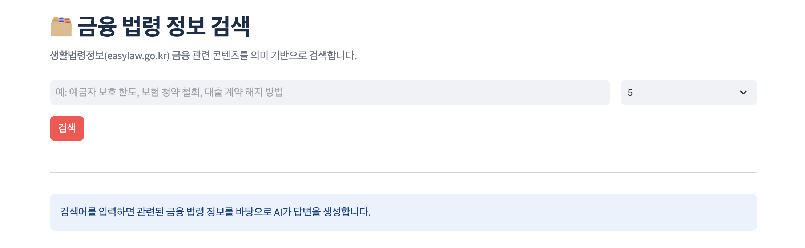
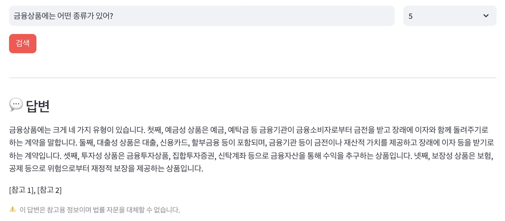

# 금융 법령 정보 검색 시스템 (RAG)

생활법령정보(easylaw.go.kr)의 금융 관련 법령 콘텐츠를 수집하고, 의미 기반 검색과 AI 답변 생성을 결합한 RAG(Retrieval-Augmented Generation) 시스템을 직접 구현했습니다.

"답변이 실제로 믿을 만한가?", "검색이 제대로 동작하는가?"를 **골든셋 30문항으로 정량 측정**하고, 측정값을 근거로 개선한 과정을 함께 기록했습니다.

---

## 최종 성과

골든셋 30문항 기준. 임베딩 검색만 사용하므로 LLM API 비용 없이 **결정론적으로 재현**됩니다 (`python eval/run_eval.py`).

| 지표 | 시작점 | **현재** | |
|---|---|---|---|
| Hit Rate@5 | — | **0.950** | 정답 청크를 상위 5건에 넣은 질문 비율 |
| Context Recall@5 | 0.817 | **0.895** | 참조 청크 중 검색된 비율 (RAGAS non-LLM) |
| MRR@5 | 0.642 | **0.808** | 첫 정답 순위의 역수 평균 |
| nDCG@5 | — | **0.796** | 정답이 여러 개인 질문의 순위 품질 |
| Context Precision@5 | — | **0.783** | 순위 가중 정밀도 (RAGAS non-LLM) |
| Context Recall@5 (post-filter) | 0.667 | **0.745** | 임계값을 통과해 LLM에 실제 전달된 비율 |
| Abstention Accuracy | 0.200 | **0.700** | 답이 없는 질문에서 답변을 거부한 비율 |

`시작점` = 58청크 / `ko-sroberta` / 임계값 0.5. `현재` = 101청크 / `KURE-v1` / 임계값 0.55.
`—`는 해당 지표를 도입하기 전이라 측정값이 없다는 뜻입니다.

**핵심 판단 3가지**

1. **임베딩 모델 교체가 유일하게 모든 지표를 동시에 올렸습니다.** 사용하던 모델의 실제 입력 상한이 문서에 적힌 512토큰이 아니라 **128토큰**이었고, 청크 106개 중 **49개(46%)가 벡터화 단계에서 잘리고** 있었습니다. 8192토큰 모델(`KURE-v1`)로 바꾸자 잘림 0건, Context Recall@5 0.787 → 0.895.
2. **금융 도메인 특화 모델은 측정해 보고 기각했습니다.** `kakaobank/kf-deberta-base`는 풀링 레이어가 없는 MLM 인코더라 그대로 쓰면 검색이 무너지고(Recall@5 0.475), 파인튜닝판도 같은 임계값에서는 기존 모델에 뒤졌습니다. "도메인 특화"라는 이름만으로 채택하지 않았습니다.
3. **다음 병목은 순위입니다.** nDCG@5 0.796이 Context Recall@5 0.895보다 10p 낮습니다. 정답을 찾기는 하는데 상위로 못 올린다는 뜻이고, MRR@5는 **첫** 정답만 보기 때문에 이 격차를 드러내지 못했습니다. 리랭커 도입의 정량적 근거입니다.

측정 과정 전문(지표 정의, 기각한 실험, 임계값 스윕) → **[docs/evaluation.md](docs/evaluation.md)**
커밋 단위 개선 이력 → **[docs/changelog.md](docs/changelog.md)**

---

## 화면

<p align="center"></p>
<p align="center"></p>

> 스크린샷과 표시된 유사도 점수는 2026-07-29 모델 교체 이전(`jhgan/ko-sroberta-multitask`) 기준이라 현재 값과 다릅니다.

**주요 기능**

* **의미 기반 검색** — 키워드 매칭이 아닌 벡터 유사도(코사인) 기반
* **AI 답변 생성** — Upstage Solar Pro3로 검색된 청크만을 근거로 답변
* **출처 표시** — 답변 근거가 된 법령 원문 청크를 유사도 점수와 함께 표시
* **답변 보류** — 임계값을 넘는 청크가 없으면 LLM 호출 자체를 건너뜀

---

## 기술 스택

| 구성 요소 | 기술 |
|-----------|------|
| 데이터 수집 | requests, BeautifulSoup4 |
| 임베딩 모델 | [nlpai-lab/KURE-v1](https://huggingface.co/nlpai-lab/KURE-v1) (한국어 특화, 8192토큰, 1024차원) |
| 벡터 DB | FAISS (IndexFlatIP + L2 정규화 = 코사인 유사도) |
| LLM | Upstage Solar Pro3 |
| 웹 UI | Streamlit |

---

## 데이터 파이프라인

각 단계는 독립 스크립트이고 파일로만 연결됩니다. 순서대로 실행하면 `app.py`가 쓰는 산출물이 만들어집니다.

| 단계 | 스크립트 | 산출물 |
|---|---|---|
| 1. 크롤링 | `src/crawling.py` | `data/law_data.json` |
| 2. EDA | `docs/text_eda.ipynb` | (청킹 파라미터 결정) |
| 3. 추출 | `src/extract.py` | `data/text_sections.json` |
| 4. 청킹 | `src/chunking.py` | `data/chunks.json` |
| 5. 임베딩 | `src/embedding.py` | `index/embeddings.npy`, `data/chunks_meta.json` |
| 6. 인덱스 구축 | `src/vector_search.py` | `index/faiss_index.bin` |
| 7. 서비스 | `app.py` | Streamlit 앱 |

**설계상 중요한 결정**

* **heading을 만날 때마다 새 레코드를 시작합니다.** 기존에는 섹션의 소제목을 별도 리스트로 모으고 본문을 통째로 이어 붙여, 어떤 소제목에 속한 내용인지 알 수 없었습니다. 청크 제목이 `대제목 : 소제목` 형식이 되고 `embedding.py`가 제목도 함께 임베딩하므로, 소제목이 검색 신호로 쓰입니다 (38 섹션 → 93 레코드 → 101 청크).
* **표는 1개 = 청크 1개로 유지합니다.** 표가 청크 경계로 잘리면 헤더와 행의 대응이 끊겨 사실상 못 쓰게 됩니다. `MAX_TABLE_CHUNK_SIZE`(4000자)를 넘는 비정상적으로 큰 표만 행 경계에서 분할하고 조각마다 헤더를 반복하는 안전장치를 두었으며, 현재 데이터(최대 1853자)에서는 동작하지 않습니다.
* **청크 크기 500자 / 최대 700자 / 최소 100자** — `docs/text_eda.ipynb`의 길이 분포 분석에서 도출했습니다.

---

## 설치 및 실행

```bash
pip install -r requirements.txt
export UPSTAGE_API_KEY="your-upstage-api-key"   # 없으면 검색 결과만 표시
streamlit run app.py
```

`data/chunks_meta.json`과 `index/faiss_index.bin`은 레포에 포함되어 있어 크롤링 없이 바로 실행됩니다. 다시 만들려면 위 파이프라인 표의 1~6단계를 순서대로 실행하세요. 최초 실행 시 임베딩 모델(약 2.2GB)을 내려받습니다.

---

## 검색 예시

| 질문 | 답변 |
|----|-----|
| 모르는 사람에게 잘못 송금했습니다. 송금한 금액을 돌려받을 수 있는 방법이 있을까요? | "착오송금 반환지원제도를 통해 송금한 금액을 돌려받을 수 있습니다. 자금이체 금융회사 등을 통하여 착오 송금한 송금인의 신청이 있는 경우 예금보험공사가 대신 찾아주는 제도입니다. 해당 제도는 「예금자보호법」 제39조의2제1항에 근거하며, 예금보험공사 금융안심포털(https://fins.kdic.or.kr) 에서 신청대상여부 확인 및 반환지원신청을 할 수 있습니다." |
| 금융상품에는 어떤 종류가 있어? | "금융상품에는 크게 네 가지 유형이 있습니다. 첫째, 예금성 상품은 예금, 예탁금 등 금융기관이 금융소비자로부터 금전을 받고 장래에 이자와 함께 돌려주기로 하는 계약을 말합니다. 둘째, 대출성 상품은 대출, 신용카드, 할부금융 등이 포함되며 (…)" |
| 차를 사서 500만원을 12개월 할부로 갚으려고 해. 매달 얼마 내면 돼? | "**제공된 참고 자료에는** 할부 구매와 관련된 구체적인 상환 금액 계산 방법이 **포함되어 있지 않습니다.** 따라서 정확한 상환 금액을 안내하기 위해서는 해당 금융 상품의 이자율 및 상환 조건을 확인해야 합니다." — 수치 계산을 요구하는 질문은 계산하지 않고 자료 범위를 안내합니다 |

---

## 남은 과제

* **순위 품질** — nDCG@5 0.796 < Context Recall@5 0.895. 정답을 찾고도 3~4위에 두는 질문이 남아 있어 리랭커가 다음 후보입니다.
* **구어체 질문의 임계값 탈락** — post-filter Context Recall이 구어체에서 0.550입니다. col-05·col-06·col-07은 정답을 상위 5건에 찾아내지만(Recall 1.00) 유사도 0.50~0.52로 임계값 0.55를 못 넘습니다. 위 순위 문제와 원인이 같아 리랭커 하나로 함께 움직일 수 있습니다.
* **Faithfulness / Answer Relevancy 미측정** — LLM 판정이 필요하고, `app.py`가 최상위 Streamlit 스크립트라 시스템 프롬프트를 평가 스크립트에서 재사용할 수 없습니다. 프롬프트와 `generate_answer`를 `src/`로 분리하는 작업이 선행되어야 합니다.
* **수치 정확성** — 프롬프트에 계산 금지 규칙을 두었으나, 생성된 답변의 수치를 원본 청크와 대조하는 결정론적 검증은 없습니다.
* **골든셋 크기** — 무정답 문항 10개로 임계값을 골랐습니다. Abstention Accuracy 0.700은 과적합 위험이 있어 참고값으로 봐야 합니다.

---

## 파일 구조

```text
RAG-Finance/
├── app.py                   # Streamlit 메인 앱 (진입점)
├── src/                     # 파이프라인 스크립트
│   ├── crawling.py          # easylaw.go.kr 크롤러
│   ├── extract.py           # law_data → text_sections 변환
│   ├── chunking.py          # 텍스트 청킹
│   ├── embedding.py         # 벡터 임베딩 생성
│   └── vector_search.py     # FAISS 인덱스 구축 및 검색
├── eval/                    # 검색 품질 평가
│   ├── golden_set.json      # 골든셋 30문항 (질문 + 정답 chunk_id)
│   ├── run_eval.py          # 표준 검색 지표 측정
│   ├── crawl_qna.py         # 100문100답 크롤러 (구어체 질문 원천)
│   └── qna_raw.json
├── data/                    # 원본 및 처리 데이터 (커밋됨)
├── index/                   # 벡터 인덱스 (커밋됨)
├── docs/
│   ├── evaluation.md        # 측정 지표 정의와 개선 과정 상세
│   ├── changelog.md         # 커밋 단위 개선 이력
│   └── text_eda.ipynb       # 텍스트 길이 분포 EDA
└── image/                   # UI 스크린샷
```

---

## 주의사항

* 이 시스템은 정보 제공 목적이며, 법률 자문을 대체하지 않습니다.
* `UPSTAGE_API_KEY`가 없을 경우 AI 답변 없이 검색 결과만 표시됩니다.
* 데이터 출처: [국가법령정보센터 생활법령정보](https://www.easylaw.go.kr)
