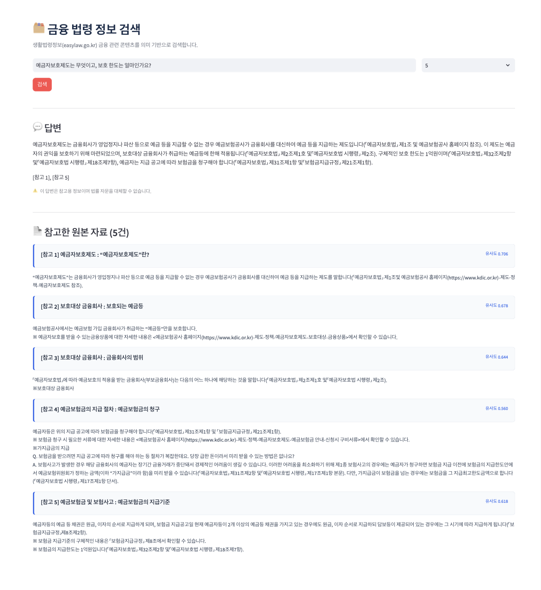

# 금융 법령 정보 검색 시스템 (RAG)

생활법령정보(easylaw.go.kr)의 금융 관련 콘텐츠를 수집하고, **하이브리드 검색 + AI 답변 생성**을 결합한 RAG 시스템을 구현했습니다.

검색 품질과 답변 보류 성능을 **골든셋 56문항**으로 정량 평가하고, 측정 결과를 기반으로 임베딩·검색·게이트를 개선했습니다.

---

## 최종 성과

총 **56문항**으로 평가했습니다.

* 정답 근거가 있는 질문: **28문항**
* 답변 근거가 없는 질문: **28문항**

검색 평가는 정답 근거가 존재하는 28문항, 답변 보류 평가는 무정답 28문항을 각각 사용합니다. 검색 평가는 LLM 호출 없이 결정론적으로 재현할 수 있습니다.

```bash
python eval/run_eval.py
python eval/run_eval.py --dense
```

### 검색 품질 — 밀집 검색 vs 하이브리드

**정답 근거가 존재하는 28문항 기준**

| 지표                  | 밀집 검색 | **하이브리드** |
| ------------------- | ----: | --------: |
| Hit Rate@5          | 0.929 | **1.000** |
| Context Recall@5    | 0.889 | **0.961** |
| MRR@5               | 0.827 | **0.848** |
| nDCG@5              | 0.818 | **0.847** |
| Context Precision@5 | 0.810 | **0.823** |

유형별 Context Recall@5: 법령 용어 **0.940** / 구어체 **0.950** / 조항 번호 **1.000**

### 답변 게이트 — 단일 vs 2단 게이트

두 방식 모두 하이브리드 검색을 사용하며 게이트만 다릅니다.

| 지표                             | 단일 0.55 | **0.52 → 0.44** |
| ------------------------------ | ------: | --------------: |
| 답변 커버리지                        |   0.821 |       **0.929** |
| Context Recall@5 (post-filter) |   0.746 |       **0.889** |
| 구어체 전달률                        |   0.550 |       **0.850** |
| 거부율                            |   0.571 |       **0.536** |

무정답 문항을 10개에서 28개로 확장하면서 거부율의 분모가 달라졌습니다. 명백히 거부해야 하는 19문항만 보면 **0.789 → 0.737**입니다.

---

## 핵심 개선 3가지

### 1. 임베딩 모델 교체

기존 임베딩 모델의 실제 입력 상한이 **128토큰**으로 설정되어 있어 106개 청크 중 **49개(46%)가 잘리는 문제**를 확인했습니다.

`KURE-v1`으로 교체한 뒤 청크 잘림이 **0건**으로 감소했고, 검색 지표가 전반적으로 개선됐습니다.

### 2. 질의 유형별 하이브리드 검색

RRF를 동일 가중으로 적용하면 Context Recall@5가 **0.889 → 0.812**로 오히려 하락했습니다.

밀집 검색은 일반 질의에 강한 반면, 조문 번호처럼 정확한 어휘 매칭이 필요한 질의에서는 BM25가 효과적이었습니다.

따라서 **조문 번호가 포함된 질의에만 BM25 가중치를 높이는 조건부 하이브리드 검색**으로 변경했고,

* Context Recall@5: **0.961**
* 악화 문항: **0건**
* 조항 번호 유형 Recall: **0.875 → 1.000**

을 확인했습니다.

### 3. 단일 임곗값의 한계 확인

무정답 질문의 점수 분포와 정답 질문의 점수 분포가 크게 겹쳐 단일 임곗값만으로는 답변 가능 여부를 안정적으로 구분할 수 없었습니다.

이에 판단을 두 단계로 분리했습니다.

* **답할 수 있는가?** → 최고 유사도 **0.52**
* **어떤 청크를 근거로 사용할 것인가?** → **0.44 이상**

그 결과 답변 커버리지는 **0.821 → 0.929**, post-filter Recall은 **0.746 → 0.889**로 개선됐습니다.

---

## 화면

> 메인 화면
<p align="center"></p>

> 실행 화면
<p align="center"></p>


### 주요 기능

* **하이브리드 검색** — 벡터 검색과 BM25를 RRF로 결합
* **AI 답변 생성** — 검색된 근거 청크를 기반으로 Upstage Solar Pro3가 답변 생성
* **출처 표시** — 검색 청크, 유사도 점수, `[참고 N]` 출처 제공
* **답변 보류** — 2단 게이트를 통과한 근거가 없으면 LLM 호출 차단

---

## 기술 스택

| 구성 요소  | 기술                           |
| ------ | ---------------------------- |
| 데이터 수집 | requests, BeautifulSoup4     |
| 임베딩    | nlpai-lab/KURE-v1 · 1024차원   |
| 벡터 검색  | FAISS · IndexFlatIP + L2 정규화 |
| 어휘 검색  | rank-bm25 · BM25Okapi + RRF  |
| LLM    | Upstage Solar Pro3           |
| 웹 UI   | Streamlit                    |

---

## 데이터 파이프라인

각 단계는 독립 실행 스크립트로 구성하고, 공통 설정과 검색 로직은 모듈화해 서비스와 평가 코드에서 재사용합니다.

| 단계 | 스크립트 | 산출물 |
|---|---|---|
| 1. 크롤링 | `src/crawling.py` | `data/law_data.json` |
| 2. EDA | `docs/text_eda.ipynb` | (청킹 파라미터 결정) |
| 3. 추출 | `src/extract.py` | `data/text_sections.json` |
| 4. 청킹 | `src/chunking.py` | `data/chunks.json` |
| 5. 임베딩 | `src/embedding.py` | `index/embeddings.npy`, `data/chunks_meta.json` |
| 6. 인덱스 구축 | `src/vector_search.py` | `index/faiss_index.bin` |
| 7. 서비스 | `app.py` | Streamlit 앱 |


### 설계상 주요 결정

* **Heading 기반 청킹** — `대제목 : 소제목`을 청크 제목으로 구성해 검색 신호로 활용
* **표 구조 보존** — 표의 헤더와 행 관계가 유지되도록 청크 구성
* **청크 크기 최적화** — EDA를 기반으로 기본 500자, 최대 700자로 설정
  실측 중앙값 **189자**, 최대 **1,853자**
* **구조 변화** — 38개 섹션 → 93개 레코드 → 101개 청크

---

## 설치 및 실행

```bash
pip install -r requirements.txt

export UPSTAGE_API_KEY="your-upstage-api-key"

streamlit run app.py
```

`UPSTAGE_API_KEY`가 없으면 AI 답변 없이 검색 결과만 확인할 수 있습니다.

---

## 검색 예시

현재 구성(`KURE-v1` · 하이브리드 검색 · 2단 게이트)에서 실행한 결과입니다.

| 질문 | 답변 |
|----|-----|
| 모르는 사람에게 잘못 송금했습니다. 송금한 금액을 돌려받을 수 있는 방법이 있을까요? | "착오송금 반환지원제도를 통해 송금한 금액을 돌려받을 수 있습니다. 해당 제도는 자금이체 금융회사 등을 통해 착오 송금한 송금인의 신청이 있는 경우 예금보험공사가 대신 찾아주는 제도입니다. 구체적인 신청 방법은 예금보험공사 금융안심포털에서 확인할 수 있으며, 신청대상여부도 해당 포털에서 확인할 수 있습니다. 이 답변은 법률 자문이 아닌 정보 제공 목적입니다." |
| 예금자보호제도는 무엇이고, 보호 한도는 얼마인가요? | "…구체적인 보호 한도는 1억원이며(「예금자보호법」 제32조제2항 및 「예금자보호법 시행령」 제18조제7항), 예금자는 지급 공고에 따라 보험금을 청구해야 합니다."<br> — 근거 조문까지 함께 인용합니다 |
| 예금자보호로는 5천만원까지만 보장 받을 수 있어? | "예금자보호는 일반적으로 **1억원까지** 보장되며, 이는 「예금자보호법」 및 관련 시행령에서 규정하고 있습니다. (…)" <br> — 질문에 담긴 잘못된 전제를 그대로 받지 않고 바로잡습니다 |
| 차를 사서 500만원을 12개월 할부로 갚으려고 해. 매달 얼마 내면 돼? | "관련성이 높은 자료를 찾지 못해 AI 답변 생성을 건너뜁니다. 검색 결과만 표시합니다." <br> — LLM 호출 자체를 하지 않습니다 |

---

## 남은 과제

### 1. 추출 단계의 목록 유실 — 최우선

원문의 번호·글머리 목록이 추출 과정에서 누락되어 **101개 청크 중 20개(20%)**에서 정보가 손실됐습니다.

검색에 성공하더라도 원문 자체가 불완전하면 답변에 필요한 조건을 복원할 수 없다는 점에서 **검색 이전 단계의 품질 관리가 필요합니다.**

### 2. 어휘 함정

코퍼스와 관련된 단어를 포함하지만 실제 답변 근거가 없는 질문은 **9문항 중 1건만 거부**했습니다.

유사도만으로는 주제 관련성과 답변 가능성을 구분하기 어려워 **리랭커 또는 생성 단계 검증**이 필요합니다.

### 3. 검색 순위 문제

`Context Recall@5 = 0.961`의 손실은 두 문항에서 발생합니다.

특히 `col-02`는 정답 청크가 **유사도 0.504**로 컨텍스트 하한을 넘지만 **10위**에 있어 Top-5에서 제외됐습니다.

→ 단순 임곗값 조정보다 **Cross-Encoder 리랭커**가 적합한 개선 방향입니다.

### 4. 생성 품질 자동 평가

현재 Faithfulness와 Answer Relevance는 정량 평가하지 않았습니다.

다음 단계에서는 생성 로직을 모듈화한 뒤 **LLM-as-a-judge 또는 사람 판정 기반 검증**을 추가할 예정입니다.

### 5. 수치 정확성 검증

프롬프트에 계산 금지 규칙은 적용했지만, 답변에 포함된 **금액·기간·비율을 근거 청크와 자동 대조하는 검증은 미구현**입니다.

### 6. 골든셋 확대

현재 정답 28문항 + 무정답 28문항으로 구성되어 있어 개별 문항의 영향이 큽니다.

`Context Recall@5 +0.072`의 페어드 부트스트랩 95% CI는 **[0.000, 0.179]**로, 통계적 유의성보다는 **악화 문항 0개와 실제 실패 사례 분석을 근거로 개선안을 채택**했습니다.

---

## 파일 구조

```text
RAG-Finance/
├── app.py
├── src/
│   ├── config.py
│   ├── crawling.py
│   ├── extract.py
│   ├── chunking.py
│   ├── embedding.py
│   └── vector_search.py
├── eval/
│   ├── golden_set.json
│   ├── run_eval.py
│   ├── crawl_qna.py
│   └── qna_raw.json
├── data/
├── index/
├── docs/
│   ├── evaluation.md
│   ├── build_process.md
│   ├── changelog.md
│   ├── rag_quality_docs.html
│   └── text_eda.ipynb
└── image/
```

---

## 참고 문서

* `docs/evaluation.md` — 지표 정의, 실험 및 임계값 스윕
* `docs/changelog.md` — 개선 이력
* `docs/build_process.md` — 아키텍처 및 기술 스택

---

## 주의사항

본 시스템은 **정보 제공 목적**이며 법률 자문을 대체하지 않습니다.

데이터 출처: [국가법령정보센터 생활법령정보](https://www.easylaw.go.kr)
